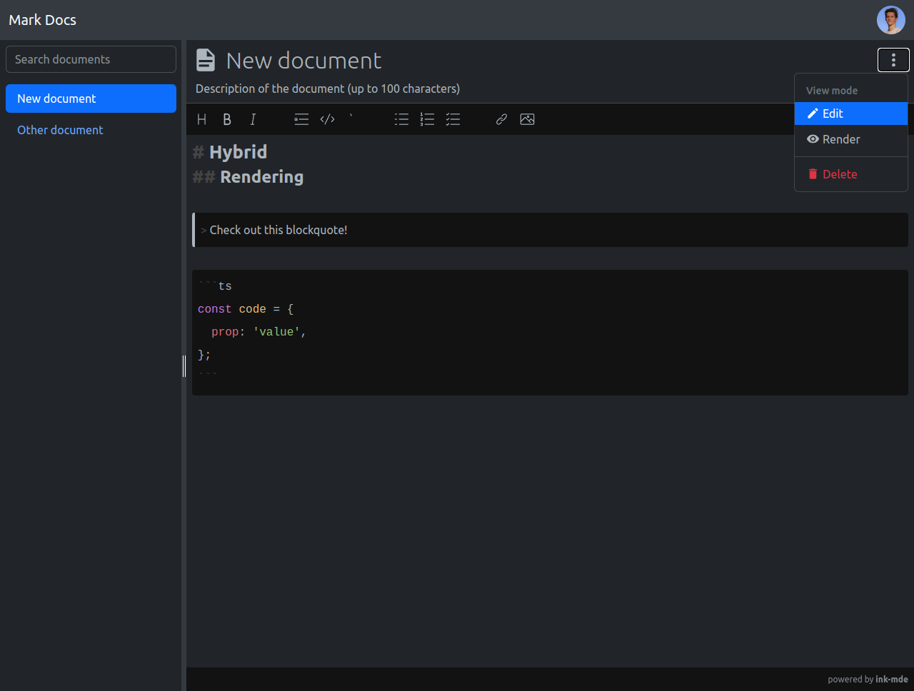

# mark-docs

> Write markdown documents with hybrid rendering!

## About the project

This app uses
[`ink-mde`](https://github.com/voracious/ink-mde),
[`svelte-splitpanes`](https://github.com/orefalo/svelte-splitpanes),
and [`bootstrap`](https://github.com/twbs/bootstrap)
to create a beautiful and highly interactive UI.

## Features

- Light and dark modes.
- Share documents, manage permissions.
- Hybrid markdown rendering (inline rendering, and full render mode).
- **FUTURE:** Customizable markdown editor.

## Shortcuts available

- <kbd>Ctrl</kbd> + <kbd>D</kbd>: Creates a new document.
- <kbd>Ctrl</kbd> + <kbd>S</kbd>: Saves the document.
- <kbd>Ctrl</kbd> + <kbd>E</kbd>: Sets the view mode to **edit**.
- <kbd>Ctrl</kbd> + <kbd>R</kbd>: Sets the view mode to **render**.

## FAQ

### How to set my profile picture?

Currently, the profile picture is retrieved from
[gravatar](https://gravatar.com/).
Check out their page to learn how to create a profile.

## To do's

- Email confirmation.
- Reset password via magic link.
